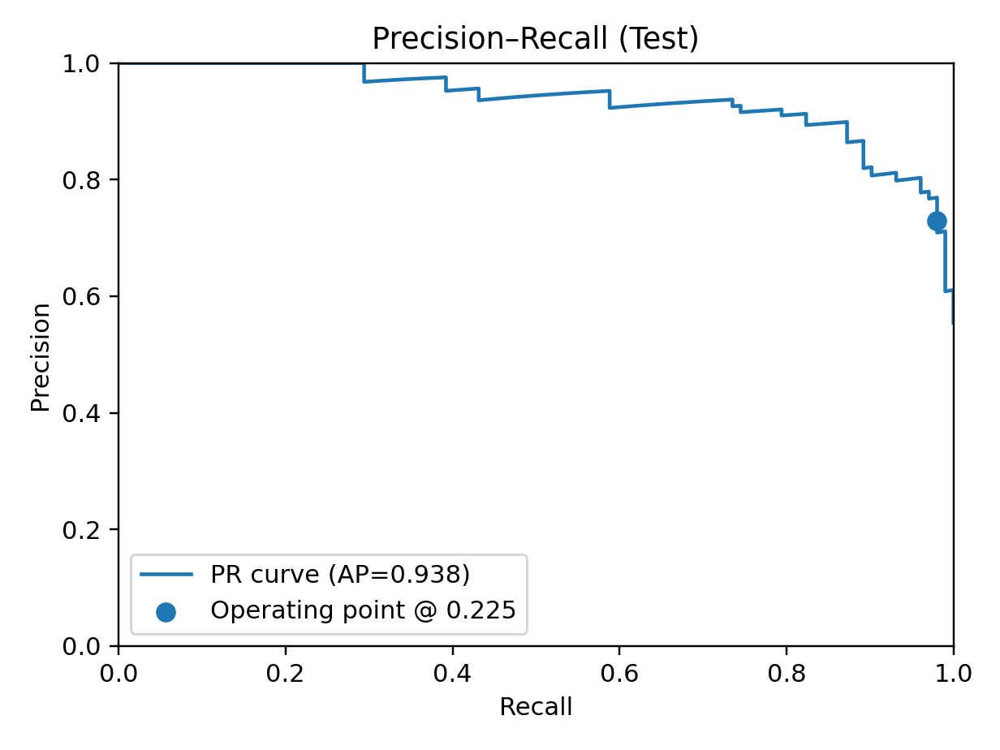
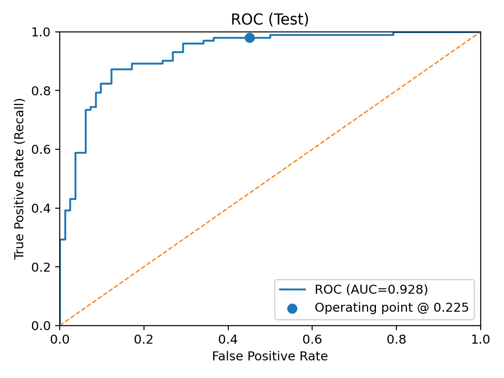
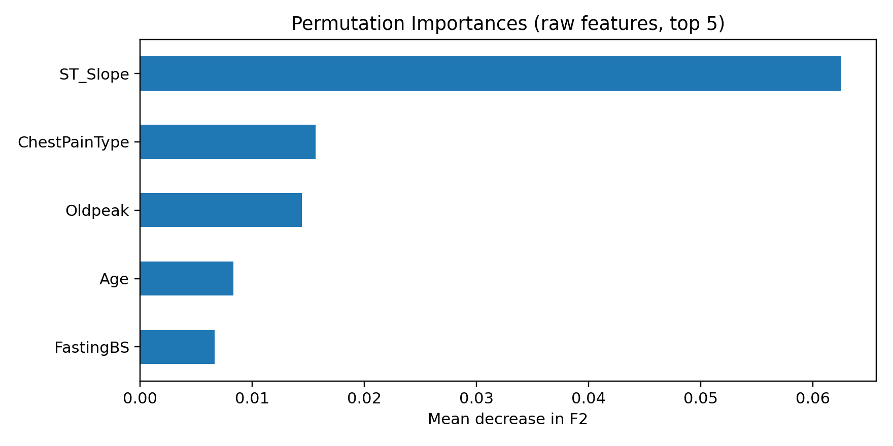

# Heart Disease Risk — High-Recall Classifier

> **Objective:** Predict heart disease and **maximize recall** while avoiding the trivial all-positive solution (optimize **F2**).

## Executive Summary
- **Data split:** Train / Validation / Test (held-out)
- **Class mix:** ~55% positive / 45% negative
- **Final model:** **Random Forest — oldpeak_binned_poly** (champion)  
- **Operating point:** tuned decision threshold **T = 0.225** (optimized for **F2** on Train+Val, then locked before Test)
- **Impact:** At this threshold we catch **98.0%** of true cases with **73.0%** precision.

## Final Test Metrics (locked threshold)
| Metric | Value |
|---|---:|
| **Recall (pos)** | **0.9804** |
| **F2** | **0.9174** |
| Precision (pos) | 0.7299 |
| Accuracy | 0.7880 |
| PR AUC | 0.9377 |
| ROC AUC | 0.9275 |

> Evaluated **once** on the untouched Test set at the locked threshold.

## Confusion Matrix (Test @ T = 0.225)
|            | Pred 0 | Pred 1 |
|---|---:|---:|
| **True 0** | **45** | **37** |
| **True 1** | **2**  | **100** |

- **Recall (TPR)** = 100 / (100 + 2) = **0.9804**  
- **Precision (PPV)** = 100 / (100 + 37) = **0.7299**  
- **Specificity** = 45 / (45 + 37) = **0.5488**

## Precision–Recall Curve (Test)
Chosen operating point marked at **T = 0.225**.  

## ROC Curve (Test)
Operating point shown; **ROC AUC = 0.9275**.  

## Top Features (Permutation Importance, Validation; scored by F2)
Dominant contributors: **ST_Slope** (strongest), **ChestPainType**, then **FastingBS / ExerciseAngina / Oldpeak**.  

---

## Method
- **Preprocessing:** Median imputation; One-Hot Encoding for categoricals; targeted transforms (e.g., binning Oldpeak); polynomial features in select variants.
- **Model selection:** Multiple feature sets and model families (Logistic Regression, Random Forest) compared with **Stratified** CV on Train; candidates ranked by **validation F2**.
- **Threshold tuning:** Decision threshold tuned for **F2** on **Train+Validation**; threshold **locked** before Test.
- **Final evaluation:** Single pass on Test at the locked threshold. Reported both **operating-point metrics** (Recall, F2, Precision, Accuracy) and **threshold-free** metrics (PR AUC, ROC AUC).

## Reproducibility
- `notebooks/` — EDA, modeling, threshold tuning, report figures  
- `models/` — final artifacts (e.g., `model.joblib`, `threshold.json`)  
- `assets/` — exported figures:
  - `fig_confusion_test.png`
  - `fig_prcurve_test.png`
  - `fig_roc_test.png`
  - `fig_features_val.png`
- `requirements.txt` — library versions / seeds

---

### Notes for reviewers
- Operating point prioritizes **high recall** (minimizing missed cases) with a documented precision trade-off.
- PR/ROC AUC give threshold-free context; the chosen threshold reflects an F2-optimal point selected **before** Test evaluation.
